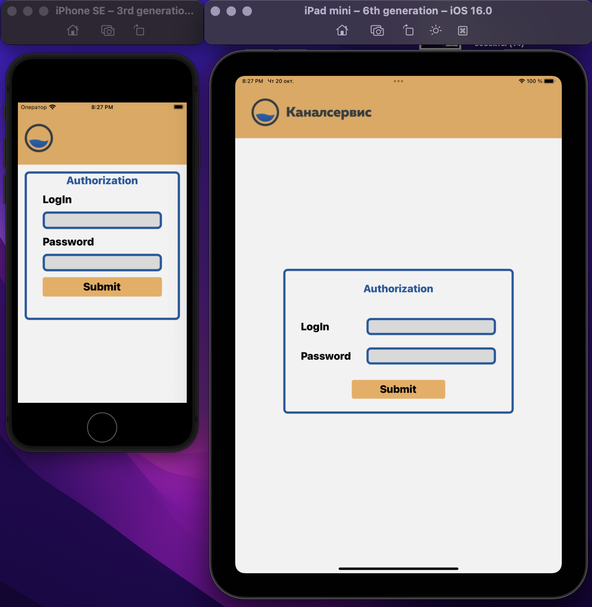
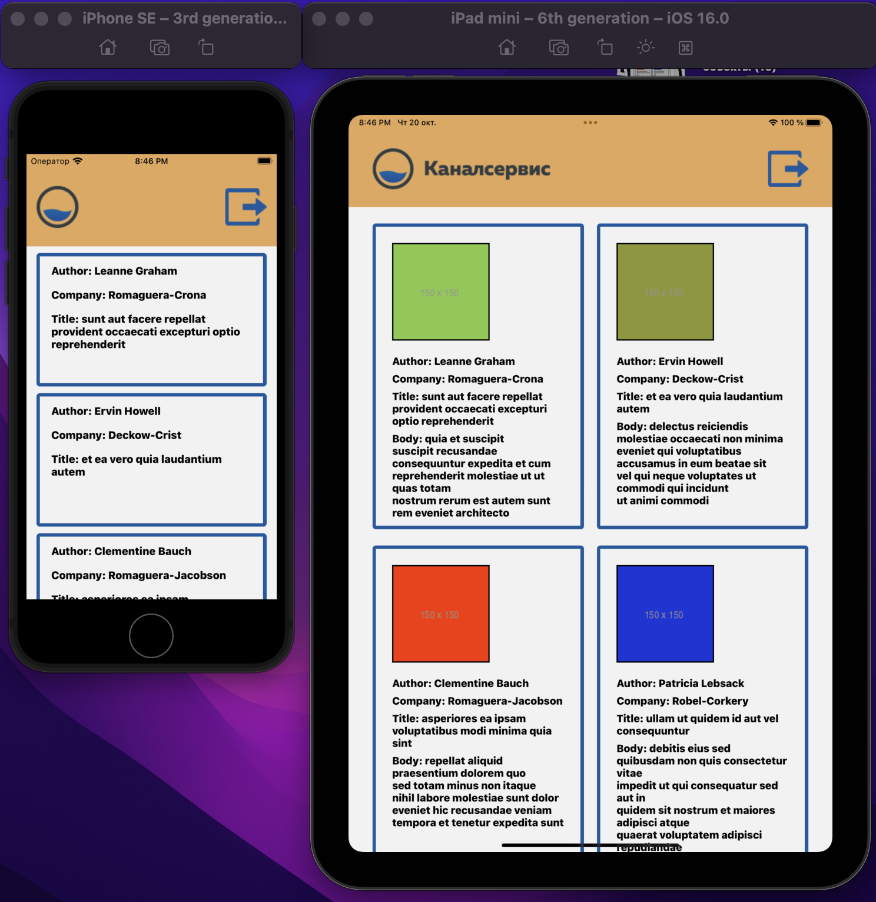

# Kanalservis Task
___

### ReactNative test assignment with Expo

The user login field is displayed on the screen with a list of users.

The application makes API requests and receives lists of users, posts and photos.

The phone shows the username, company, title of the post.

The tablet shows the username, company, title of the post, the content of the post and the photo.

___LogInScreen___

___UsersScreen___

### login: **user**
### password: **password**
